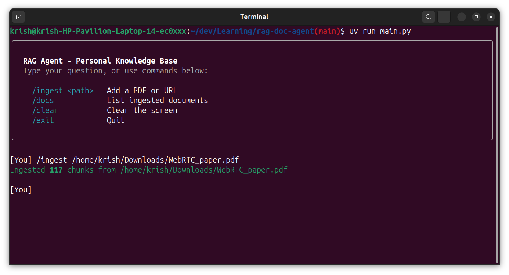
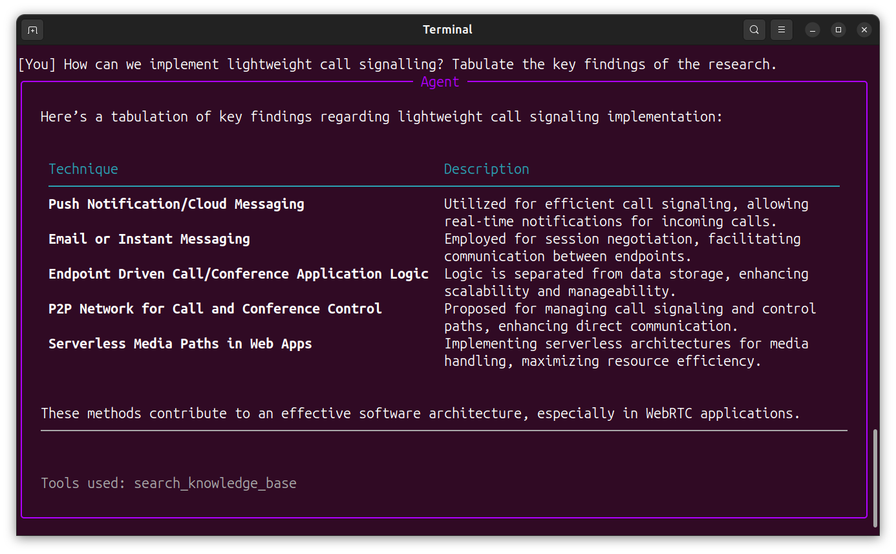

# RAG Agent

A terminal-based AI research agent that lets you ingest documents (and webpages) and query them with natural language. Built with LangChain, ChromaDB, PydanticAI, and OpenAI.


## Features
 
- **Hybrid retrieval**: combines semantic vector search with BM25 keyword search for higher accuracy
- **HyDE (Hypothetical Document Embedding)**: embeds a hypothetical answer instead of the raw question to bridge the question/answer embedding gap
- **Query rewriting**: rewrites vague queries into precise search terms before hitting the vector store
- **Multi-angle search**: generates multiple query rephrasings for broad or ambiguous questions
- **Streaming responses**: tokens stream live to the terminal, then re-render as formatted markdown
- **Persistent history**: query history saved across sessions via `.rag_history`
- **Rich terminal UI**: markdown rendering, spinners, and panels using `rich` and `prompt_toolkit`


## Screenshots




## Tech Stack
 
| Component | Library |
|---|---|
| LLM | OpenAI gpt-4o-mini |
| Embeddings | OpenAI text-embedding-3-small |
| Vector store | ChromaDB |
| RAG framework | LangChain |
| Agent framework | PydanticAI |
| Terminal UI | Rich + Prompt Toolkit |
| Package manager | uv |


## Project structure
 
```
rag-doc-agent/
├── ingest.py      # Document loading, chunking, and embedding
├── rag.py         # Hybrid retrieval chain with HyDE
├── agent.py       # PydanticAI agent with tool definitions
├── main.py        # Terminal interface with streaming
├── prompts.py     # Collection of all the prompts used
├── chroma_db/     # Persisted vector store (auto-created)
└── .rag_history   # Query history (auto-created)
```


## Setup
 
**Prerequisites:** Python 3.12+, [uv](https://docs.astral.sh/uv/)
 
```bash
# Clone and enter the project
git clone https://github.com/Krishnanand2517/rag-doc-agent
cd rag-doc-agent
 
# Install dependencies
uv sync
```

Add the API keys to `.env`:
```bash
OPENAI_API_KEY=your-key-here
USER_AGENT=rag-doc-agent/1.0
```


## Usage
 
### Start the chat interface
 
```bash
uv run main.py
```

### Commands inside the chat
 
| Command | Description |
|---|---|
| `/ingest <path>` | Ingest a local PDF |
| `/ingest <url>` | Ingest a webpage |
| `/docs` | List all ingested documents |
| `/clear` | Clear the terminal |
| `/exit` | Quit |
| Any other text | Query the knowledge base |


## How it works
 
### Ingest pipeline
 
```
Document → Load → Chunk (1000 tokens, 200 overlap) → Embed → ChromaDB
```
 
### Query pipeline
 
```
User query
    → Query rewriter        (makes vague queries precise)
    → HyDE                  (generates hypothetical answer for better embedding)
    → Hybrid retriever      (vector search 60% + BM25 40%)
    → Top-5 chunks
    → Augmented prompt
    → OpenAI (streamed)
```

### Agent tools
 
- `search_knowledge_base`: for specific, targeted questions
- `search_knowledge_base_multi`: for broad or ambiguous questions; searches from 3 angles
- `list_documents`: lists all ingested documents

